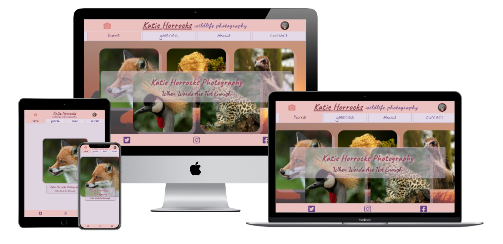
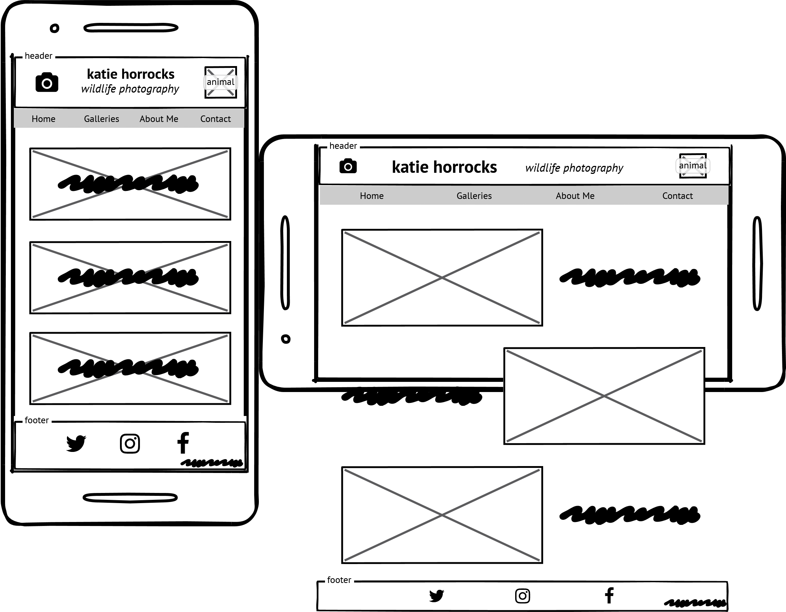
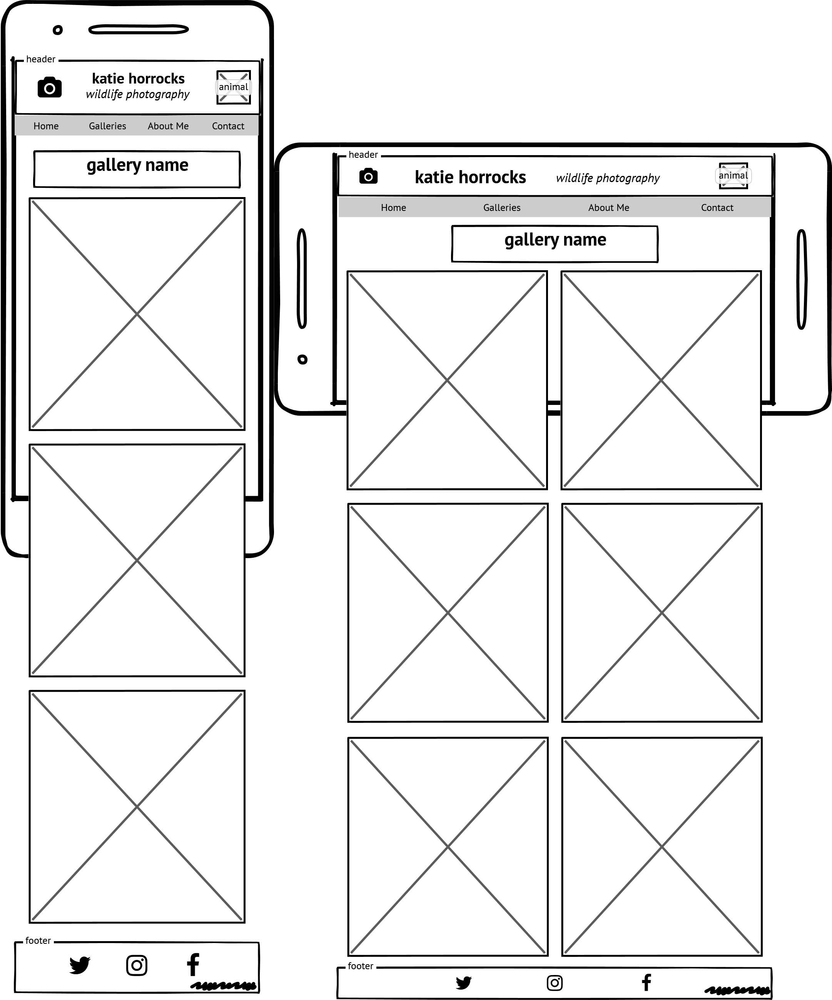
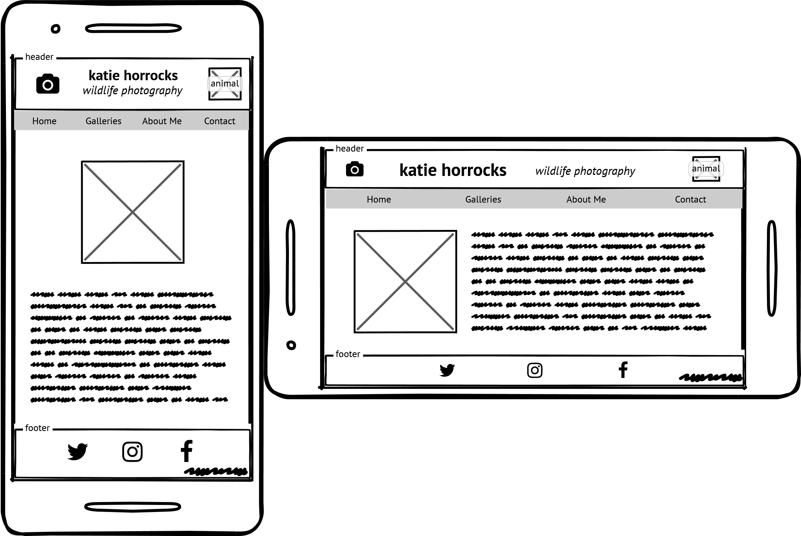
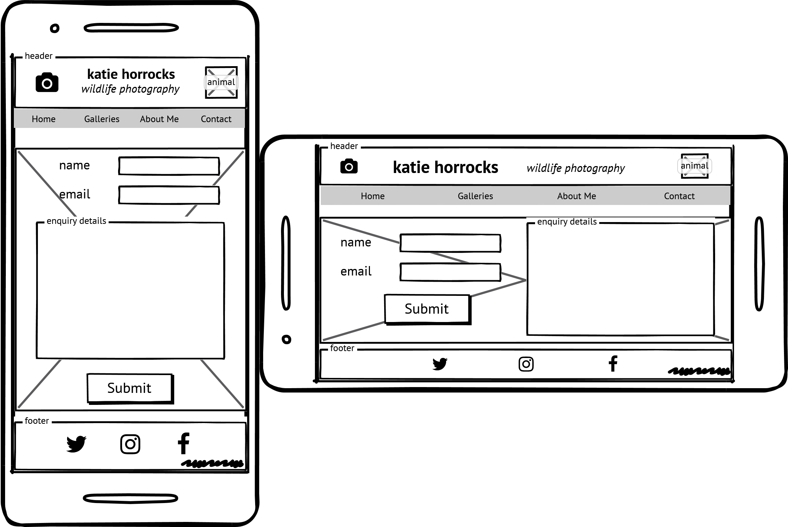
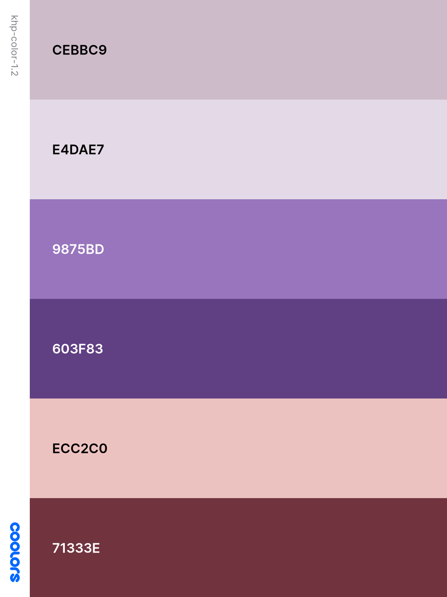
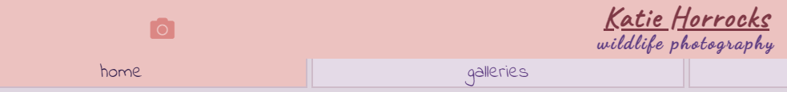

# Portfolio Project 1 - HTML/CSS Essentials

## Live Site
[Katie Horrocks - Wildlife Photography](https://daveyjh.github.io/ci-portfolio-one-v4)
## Repository
[https://github.com/daveyjh/ci-portfolio-one-v4](https://github.com/daveyjh/ci-portfolio-one-v4)
***
## Table of Contents
- [Objective](#Objective)
- [Brief](#Brief)
- [UX &#8722; User Experience Design](#UX-&#8722;-User-Experience-Design)
- [Initial Concept](#Initial-Concept)
    - [Wireframes](#Wireframes)
        - [All Wireframes - Separate Document](./readme-content/wireframes.md)
    - [Colour Scheme](#Colour-Scheme)
    - [Typography](#Typography)
    - [Imagery](#Imagery)
- [Features](#Features)
    - [Existing Features](#Existing-Features)
    - [Features Left to Implement](#Features-Left-to-Implement)
- [Technologies Used](#Technologies-Used)
- [Testing](#Testing)
- [Bugs](#Bugs)
    - [Current](#Current)
    - [Resolved](#Resolved)
- [Deployment](#Deployment)
- [Credits](#Credits)
    - [Content](#Content)
    - [Media](#Media)
    - [Acknowledgements](#Acknowledgements)
- [Personal Development](#Personal-Development)
***
## Objective
In this project I intend to provide a portfolio style website for my sister's wildlife photography.  The main objective is to demonstrate competency in HTML and CSS.  I hope to provide an emotive, static front end application which is easy to navigate and has a clear purpose.

**The needs within this project are not genuine and are made purely for the purpose of completing my Code Institute project**
***
## Brief
### **Katie Horrocks - Wildlife Photography**
The goal of this website is to promote Katie Horrocks' photography.  The client would like to have:
- a brief introduction, who she is and what she does
- the client intends to display a few small galleries
- a contact form
- links to her social media sites

Katie does not work professionally as a photographer, the site is to serve as a platform for displaying her pictures and allowing interested parties to contact her for general purposes.

*She may, at a later date, add a blog to the site so that element should be considered during the design of the application*
***
## UX &#8722; User Experience Design
### User Requirements
Some example user stories which will affect the design
 
- *"As a first time visitor, I want to know what this site is about. I may use a number of different devices (mobile/tablet etc.) to view the site. I would like to be able to navigate easily"*
- *"As a returning visitor, I want to take a look at some different galleries and possibly some social media links. I am interested in learning a little more about Katie, but I really do like the photographs"*
- *"As an interested person, I would like to see some of Katie's work. I want to be able to contact Katie, perhaps connect with her via social media"*
***
### Initial Concept
With photographic images featuring as a really important aspect of the site, I  hope to keep the design fairly free from other distractions. I anticipate using a fairly neutral colour scheme as I feel this will allow the content images to stand out more from the design aspects. The application is to be designed with 'mobile first' in mind
#### Wireframes
<!-- wireframe images and link to more -->
Home

Gallery Selection

Gallery Page

About

Contact

*See [here](./readme-content/wireframes.md#tablet) for other device types*
***
#### Colour Scheme
A neutral color scheme created using [coolors.co](https://coolors.co)


The scheme applied to the home page


*Some colours used in the final project may be shades of those listed, generated using [coolors.co](https://coolors.co)*

**I had not run the colour combinations through a contrast checker before commencing the project.** A revised colour scheme is shown below

Unfortunately the colours originally chosen gave a poor result unless taken to the extremes of light and dark. I have generated a new colour theme, again with some shades and tones to be used. The main changes are the lightening of the header and footer, and the font colour within those elements has been changed to purple

***
#### Typography
The website will not feature a great deal of text. The fonts are imported into the CSS file from [Google Fonts](https://fonts.google.com/)
- **Caveat** has been chosen as the main font for the title text. It is a friendly font which gives a more personal appearance. The fallback family of **cursive** maintains the personal appearance
- **Dancing Script** has been chosen for the 'tag line' font. The font is more calligraphic and exudes a stylish tone, relatable to the photographic content of the website. The fallback family of **cursive** means the overall style will be maintained in the event some fonts fail to render
- **Indie Flower** has been chosen as the nav menu and secondary page's title font. It maintains the welcoming mood of the site, hoping to maintain positive user experiences. As with the other larger text elements, the fallback font remains as **cursive**
- **Raleway** has been chosen as the font for any areas featuring a higher volume of text. The font is more standard but maintains a sense of personal feel with its rounded styling and light weight.  A fallback font of **Trebuchet MS** is used as it maintains the light weight appearance. A fallback family of **sans-serif** is used to maintain a contrast to the fallback of the other text elements in the website
***
#### Imagery
As the main feature of the website, the imagery will be from Katie's personal collections.  Many of the images are large files, and so will be compressed for quicker load times. The image in the header should be friendly and not too complex. The content images will be arranged into categories to allow a number of galleries to be presented.

The images will be compressed using *[Compressor.io](https://compressor.io/)*
***
## Features
 
### Existing Features
<!-- - Feature 1 - allows users X to achieve Y, by having them fill out Z -->
1. The design is made with mobile first in mind
>*"As a visitor ... **I may use a number of different devices**"*
- *the media queries in the CSS file are done in a way to keep the aesthetics of the site looking OK across the majority of screen sizes*
***
2. The header will be visible on all pages and have a maintained style throughout
>*"As a visitor ... **I would like to be able to navigate easily**"*
- *the nav menu is accessible at the bottom of the header and sticks to the top of the page if scrolled*
***
3. The header content is brief and informative and contains a couple of images
>*"As a first time visitor ... **I want to know what this site is about**"*
- *the text content in the header indicates exactly what this site is about. The images are relevant and one intends to provide a positive emotive response*

    
***
4. The home page has a large image showing animal photography
>*"As a first time visitor...**I want to know what this site is about**"*

>*"As a returning visitor...**I really do like the photographs**"*
- *the hero image shows off the type of photography included in the website, on certain devices, a few images are displayed for a little variety*

    
***
5. The footer element has accessible icons which link to social media platforms
>*"As a returning visitor...**some social media links**"*

>*"As an intersted person ... **connect with her via social media**"*
- *the social media links will be available on all pages. On all devices, the home page features a fixed footer, which is visible as soon as the page loads no matter the device type*

    
***
The footer element contains a link to my GitHub and linked in profiles
>BONUS
- *the design of the footer allows for discrete links to me, should any visitors wish to know more about the site's creator (yellow border imposed on screenshot for demonstration purposes)*

    
***
### Features Left to Implement
1. I would like to have the nav menu disappear when viewed via a landscape orientation on mobile devices
    - *The nav bar takes up valuable screen real estate on smaller devices. I would like to change the camera icon in the header to a menu icon on certain screens. This icon would act as a drop down activator for the nav menu, allowing more space for photographs*
    - The sticky position applied to the header is a workaround until I can research the drop down menu in greater depth. When the pages are scrolled, it allows the main header content to disappear, but keeps the nav menu visible. I have done some research into hidden menu's and am confident with the CSS methods to achieve this, however, there appears to be an issue with screen readers and assistive technologies. I do not wish to implement a feature which causes accessibility issues. With the research I have done, this feature would be too time consuming to implement at present for too little gain
2. The form on the contact page currently does not send information anywhere. 
    - The limitation of this project is to use CSS and HTML and so I have not yet learned about creating the necessary scripting behind the form. I have chosen to leave the form on the website to show comprehension of the form element, however **the 'action' and 'method' attributes have been removed** to prevent any issue with errors
***
## Technologies Used

<!-- In this section, you should mention all of the languages, frameworks, libraries, and any other tools that you have used to construct this project. For each, provide its name, a link to its official site and a short sentence of why it was used. -->
- *[Balsamiq](https://balsamiq.com/)*
    - Balsamiq was used to create [wireframes](./readme-content/wireframes.md) for the project
- *[Compressor.io](https://compressor.io/)*
    - All images within the project have been processed through their free compression service
- *[Font Awesome](https://fontawesome.com/)*
    - The project uses icons from Font Awesome version 5
- *[Coolors.co](https://coolors.co)*
    - The color scheme, and subsequent shades and tones, were generated via this application
- *[Visual Studio Code](https://code.visualstudio.com/)*
    - I have used this IDE as I had a very limited experience with an older version. The extensions available have allowed me to customize my workspace and become more efficient
        - Special mention to *[YuichiNukiyama](https://github.com/YuichiNukiyama)* for their *[Preview on Web Server](https://github.com/YuichiNukiyama/vscode-preview-server)* extension as this allowed a very quick visual representation of changes made
- *[Chrome DevTools](https://developer.chrome.com/docs/devtools/)*
    - Once the website was made to a basic deployment level, this extension featured heavily as I modified sizings and spacings
- *[Google Fonts](https://fonts.google.com/)*
    - The fonts used in the website are imported from Google Fonts
- *[Multi Device Mockup Generator](https://techsini.com/multi-mockup/index.php)*
    - The image at the top of this document was created using a free service provided by TechSini.com
***
## Testing

<!-- In this section, you need to convince the assessor that you have conducted enough testing to legitimately believe that the site works well. Essentially, in this part you will want to go over all of your user stories from the UX section and ensure that they all work as intended, with the project providing an easy and straightforward way for the users to achieve their goals.

Whenever it is feasible, prefer to automate your tests, and if you've done so, provide a brief explanation of your approach, link to the test file(s) and explain how to run them.

For any scenarios that have not been automated, test the user stories manually and provide as much detail as is relevant. A particularly useful form for describing your testing process is via scenarios, such as:

1. Contact form:
    1. Go to the "Contact Us" page
    2. Try to submit the empty form and verify that an error message about the required fields appears
    3. Try to submit the form with an invalid email address and verify that a relevant error message appears
    4. Try to submit the form with all inputs valid and verify that a success message appears.

In addition, you should mention in this section how your project looks and works on different browsers and screen sizes.

You should also mention in this section any interesting bugs or problems you discovered during your testing, even if you haven't addressed them yet.

If this section grows too long, you may want to split it off into a separate file and link to it from here. -->
***
## Bugs
### Current
- Having tested the website via GitHub Pages and viewing on an iOS device (iPhone XR), some sizing is not correct and leads to a bad UX
*This appears to be due to the methods of spacing and sizing I have used. At this stage, I am not going to attempt to fix this as the UX is only slightly effected and more research leads me to believe the media queries I have used are not specific enough for iOS products*
***
### Resolved
1. The anchor elements in the nav section do not span the 'tab' which they sit in. More evident on wider screens, could lead to bad UX

***index.html** - lines - **31 - 33***
~~~
    <li class="active">
        <a href="./index.html">home</a>
    </li>
~~~
*Putting the text in a div as a child of the anchor has resolved the issue. The div is a  block element, and so, fills the width of the anchor. This reduces the chance of a bad UX from the tab not accepting user input even though it has changed colour*

***index.html** - lines - **31 - 37***
~~~
    <li class="active">
        <a href="./index.html">
            <div>
                home
            </div>
        </a>
    </li>
~~~
*Commit - **[9ed8b54](https://github.com/DaveyJH/ci-portfolio-one-v4/commit/9ed8b5488bbbd882e5775e213c983fddad779b27#diff-0eb547304658805aad788d320f10bf1f292797b5e6d745a3bf617584da017051R32-R57)***
***
2. The text in the overlay container overflows out the top on smalls screens


*Issue dealt with during modifying media queries. Commits between 14:00 - 15:20 on 08/05/2021. Consisted of some font-size changes and alteration to the max-height of the containing div*
***
3. The footer encroaches far too much into the screen space on small landscape screens

*Commit - **[9831174](https://github.com/DaveyJH/ci-portfolio-one-v4/commit/98311749f1d119f4469e0e60d142e9734ed9b789#diff-a72d4ee198d130c997b203ecb2f5c54d84617b3cdf7bd9eaab804be78e2709aeL398)** - removed font-size change from **style.css** line **398***
***
4. Some screen sizes cause the lower section of overlay text to be obscured by the footer

*Commit - **[fb5cc65](https://github.com/DaveyJH/ci-portfolio-one-v4/commit/fb5cc65e3a87240f06642a4cad651c5f7c30349b)** - altered min-height value to be responsive up to 700px. From 700px, apply a minimum height value which allows the entire content to be viewed

Commit - **[6cfe816](https://github.com/DaveyJH/ci-portfolio-one-v4/commit/6cfe816bf42ac0e03b51c5331cc896e74dde2ac9#diff-a72d4ee198d130c997b203ecb2f5c54d84617b3cdf7bd9eaab804be78e2709aeR363)** - at screen min-width of 1200px, the min-height is removed to prevent obscure lower margins on the content*
***
5. The icons which link to my GitHub and LinkedIn only work at the very bottom of the rendered icon

***style.css** - lines - **183 - 185***
~~~
footer span a {
    position: relative;
}
~~~
*Setting the position to relative appears to have resolved the issue. I believe this causes the anchor element's z-index to be higher than the FontAwesome icon. When I have more time, I will try and research more about the class and styling applied by FontAwesome*

Commit - **[5847e65](https://github.com/DaveyJH/ci-portfolio-one-v4/commit/5847e655d53517ef85bfbe9b267e1f437a5b6f4a#diff-a72d4ee198d130c997b203ecb2f5c54d84617b3cdf7bd9eaab804be78e2709aeR183-R185)**
## Deployment

<!-- This section should describe the process you went through to deploy the project to a hosting platform (e.g. GitHub Pages or Heroku).

In particular, you should provide all details of the differences between the deployed version and the development version, if any, including:
- Different values for environment variables (Heroku Config Vars)?
- Different configuration files?
- Separate git branch?

In addition, if it is not obvious, you should also describe how to run your code locally. -->

***
## Credits

### Content
- The idea to link to lines of code within GitHub commits came from *[Chase Woodford](http://www.chasewoodford.com/blog/linking-highlighted-lines-code-github/)*
### Media
- The photos being used in the site are currently from *[Unsplash](https://unsplash.com)* but will be updated with photographs from Katie's albums as soon as she has chosen them
### Acknowledgements

- I received inspiration for this project from X
***
### Personal Development

Having had a session with my Code Institute mentor, I went about modifying the commit messages on most commits to include a reference to the document which had been worked on. I used the following method to modify the commit messages through git:

*In the powershell terminal within VSCode, with the repository as my current working directory, I entered the following:*

```
git rebase -i HEAD~95
```
*This generated a text document within my editor. I changed "pick" to "r" on all commits which needed document references adding*

*(snippet from document)*
```
pick 4696f63 DOC+ temporary gallery-select images
r 34b9b76 ADD images + basic styling to gallery-select
r 7e42d60 REM <a> from header. stop cursor change on text
r 6882570 ADD basic form structure
r 04e17e6 ADD placeholders + change "enquiry" to textarea
pick f45cb8e ADD styling to form [contact.html]
```
*This allowed me to edit the commit messages individually in my editor to include the document reference*
```
ADD placeholders + change "enquiry" to textarea [contact.html]
```
*Once the files were edited, saved and closed, I proceeded to force push the commits back into the GitHub repository*
```
git push --force
```
*This allowed the commit messages to be changed but changed the commit times of the messages to the time of the edit*

I thought this was a big problem and spent a while researching how to modify commit times. I tested the time change on one commit, did something wrong in the process and duplicated the entire commit history (bar the initial commit) with new SHAs, resulting in 191 commits. I believe I merged the modified commit (with original commit time) with the original branch, causing a new 'history' of commits which were duplicates of the existing ones. I then ran another rebase of the entire commit history and was able to identify the unwanted commit messages, delete the lines from the generated todo file and, once saved and forced back to GitHub, the commit duplicates ceased to be present

This process has highlighted the danger of rebase operations within a repository. Although I may occasionally rebase and edit a typo in an un-pushed commit, I think in the future, especially with pushed commits, I would prefer to make changes in a new commit and document the changes very well in a readme file

In the case of having an error within the commit message format for a while, I should have continued with a new format and made reference to the error in this document. The note would have been as follows:

*I have made an error with the first 95 commit messages within this repo. The commit messages do not indicate which documents have been worked on, leading to a more time consuming analysis of the commit history. I will endeavour to maintain a commit message structure which allows quick identification of the modified documents within the first line of the commit message [**document name here**]*

In future, if collaborating with others, I will clarify the format/content of commit messages to ensure a consistent method is applied throughout the project. I will avoid using the rebase facility of GitHub as much as possible