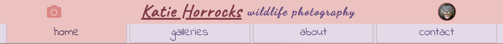

# Portfolio Project 1 - HTML/CSS Essentials
## Table of Contents
- [Objective](#Objective)
- [Brief](#Brief)
- [UX &#8722; User Experience Design](#UX-&#8722;-User-Experience-Design)
- [Initial Concept](#Initial-Concept)
    - [Wireframes](#Wireframes)
        - [All Wireframes - Separate Document](./readme-content/wireframes.md)
    - [Colour Scheme](#Colour-Scheme)
    - [Typography](#Typography)
    - [Imagery](#Imagery)
- [Features](#Features)
    - [Existing Features](#Existing-Features)
    - [Features Left to Implement](#Features-Left-to-Implement)
- [Technologies Used](#Technologies-Used)
- [Testing](#Testing)
- [Bugs](#Bugs)
    - [Current](#Current)
    - [Resolved](#Resolved)
- [Deployment](#Deployment)
- [Credits](#Credits)
    - [Content](#Content)
    - [Media](#Media)
    - [Acknowledgements](#Acknowledgements)
***
## Objective
In this project I intend to provide a portfolio style website for my sister's wildlife photography.  The main objective is to demonstrate competency in HTML and CSS.  I hope to provide an emotive, static front end application which is easy to navigate and has a clear purpose.

**The needs in this project are not genuine and are made purely for the purpose of completing my Code Institute project**
***
## Brief
### **Katie Horrocks - Wildlife Photography**
<!-- link to site here -->
The goal of this website is to promote Katie Horrocks' photography.  The client would like to have:
- a brief introduction, who she is and what she does
- the client intends to display a few small galleries
- a contact form
- links to her social media sites

Katie does not work professionally as a photographer, the site is to serve as a platform for displaying her pictures and allowing interested parties to contact her for general purposes.

*She may, at a later date, add a blog to the site so that element should be considered during the design of the application*
***
## UX &#8722; User Experience Design
### User Requirements
Some example user stories which will effect the design
 
- *"As a first time visitor, I want to know what this site is about. I may use a number of different devices (mobile/tablet etc.) to view the site. I would like to be able to navigate easily"*
- *"As a returning visitor, I want to take a look at some different galleries and possibly some social media links. I am interested in learning a little more about Katie, but I really do like the photographs"*
- *"As an interested person, I would like to see some of Katie's work. I want to be able to contact Katie, perhaps connect with her via social media"*
***
### Initial Concept
With photographic images featuring as a really important aspect of the site, I  hope to keep the design fairly free from other distractions. I anticipate using a fairly neutral colour scheme as I feel this will allow the content images to stand out more from the design aspects. The application is to be designed with 'mobile first' in mind
#### Wireframes
<!-- wireframe images and link to more -->

*See [here](./readme-content/wireframes.md#tablet) for other device types*
***
#### Colour Scheme
A neutral color scheme created using [coolors.co](https://coolors.co)

The scheme applied to the home page

*Some colours used in the final project may be shades of those listed, generated using [coolors.co](https://coolors.co)*
***
#### Typography
The website will not feature a great deal of text. The fonts are imported into the CSS file from [Google Fonts](https://fonts.google.com/)
- **Caveat** has been chosen as the main font for the title text. It is a friendly font which gives a more personal appearance. The fallback family of **cursive** maintains the personal appearance
- **Dancing Script** has been chosen for the 'tag line' font. The font is more calligraphic and exudes a stylish tone, relatable to the photographic content of the website. The fallback family of **cursive** means the overall style will be maintained in the event some fonts fail to render
- **Indie Flower** has been chosen as the nav menu and secondary page's title font. It maintains the welcoming mood of the site, hoping to maintain positive user experiences. As with the other larger text elements, the fallback font remains as **cursive**
- **Raleway** has been chosen as the font for any areas featuring a higher volume of text. The font is more standard but maintains a sense of personal feel with its rounded styling and light weight.  A fallback font of **Trebuchet MS** is used as it maintains the light weight appearance. A fallback family of **sans-serif** is used to maintain a contrast to the fallback of the other text elements in the website
***
#### Imagery
As the main feature of the website, the imagery will be from Katie's personal collections.  Many of the images are large files, and so will be compressed for quicker load times. The image in the header should be friendly and not too complex. The content images will be arranged into categories to allow a number of galleries to be presented.

The images will be compressed using *[Compressor.io](https://compressor.io/)*
***
## Features
 
### Existing Features
<!-- - Feature 1 - allows users X to achieve Y, by having them fill out Z -->
1. The design is made with mobile first in mind
>*"As a visitor ... **I may use a number of different devices**"*
- *the media queries in the css file are done in a way to keep the aesthetics of the site looking OK across the majority of screen sizes*
***
2. The header will be visible on all pages and have a maintained style throughout
>*"As a visitor ... **I would like to be able to navigate easily**"*
- *the nav menu is accessible at the bottom of the header and sticks to the top of the page if scrolled*
***
3. The header content is brief and informative and contains a couple of images
>*"As a first time visitor ... **I want to know what this site is about**"*
- *the text content in the header indicates exactly what this site is about. The images are relevant and one intends to provide a positive emotive response*

    
***
4. The home page has a large image showing animal photography
>*"As a first time visitor...**I want to know what this site is about**"*

>*"As a returning visitor...**I really do like the photographs**"*
- *the hero image shows off the type of photography included in the website, on certain devices, a few images are displayed for a little variety*

    
***
5. The footer element has accessible icons which link to social media platforms
>*"As a returning visitor...**some social media links**"*

>*"As an intersted person ... **connect with her via social media**"*
- *the social media links will be available on all pages. On all devices, the home page features a fixed footer, which is visible as soon as the page loads no matter the device type*

    
***
The footer element contains a link to my github and linked in profiles
>BONUS
- *the design of the footer allows for discrete links to me, should any visitor wish to know more about the sites creator (yellow border imposed on screenshot for demonstration purposes)*

    
***
### Features Left to Implement
1. I would like to have the nav menu disappear when viewed via a landscape orientation on mobile devices
    - *the nav bar takes up valuble screen real estate on smaller devices. I would like to change the camera icon in the header to a menu icon on certain screens. This icon would act as a drop down activator for the nav menu, allowing more space for photographs*
***
## Technologies Used

<!-- In this section, you should mention all of the languages, frameworks, libraries, and any other tools that you have used to construct this project. For each, provide its name, a link to its official site and a short sentence of why it was used. -->
- *[Balsamiq](https://balsamiq.com/)*
    - Balsamiq was used to create [wireframes](./readme-content/wireframes.md) for the project
- *[Compressor.io](https://compressor.io/)*
    - All images within the project have been processed through their free compression service
- *[Font Awesome](https://fontawesome.com/)*
    - The project uses icons from Font Awesome version 5
- *[Coolors.co](https://coolors.co)*
    - The color scheme, and subsequent shades and tones, were generated via this application
- *[Visual Studio Code](https://code.visualstudio.com/)*
    - I have used this IDE as I had a very limited experience with an older version. The extensions available have allowed me to customize my workspace and become more efficient
        - Special mention to *[YuichiNukiyama](https://github.com/YuichiNukiyama)* for their *[Preview on Web Server](https://github.com/YuichiNukiyama/vscode-preview-server)* extension as this allowed a very quick visual representation of changes made
- *[Chrome DevTools](https://developer.chrome.com/docs/devtools/)*
    - Once the website was made to a basic deployment level, this extension featured heavily as I modified sizings and spacings
- *[Google Fonts](https://fonts.google.com/)*
    - The fonts used in the website are imported from Google Fonts
***
## Testing

In this section, you need to convince the assessor that you have conducted enough testing to legitimately believe that the site works well. Essentially, in this part you will want to go over all of your user stories from the UX section and ensure that they all work as intended, with the project providing an easy and straightforward way for the users to achieve their goals.

Whenever it is feasible, prefer to automate your tests, and if you've done so, provide a brief explanation of your approach, link to the test file(s) and explain how to run them.

For any scenarios that have not been automated, test the user stories manually and provide as much detail as is relevant. A particularly useful form for describing your testing process is via scenarios, such as:

1. Contact form:
    1. Go to the "Contact Us" page
    2. Try to submit the empty form and verify that an error message about the required fields appears
    3. Try to submit the form with an invalid email address and verify that a relevant error message appears
    4. Try to submit the form with all inputs valid and verify that a success message appears.

In addition, you should mention in this section how your project looks and works on different browsers and screen sizes.

You should also mention in this section any interesting bugs or problems you discovered during your testing, even if you haven't addressed them yet.

If this section grows too long, you may want to split it off into a separate file and link to it from here.
***
## Bugs
### Current
- None found
***
### Resolved
1. The anchor elements in the nav section do not span the 'tab' which they sit in. More evident on wider screens, could lead to bad UX

***index.html** - lines - **31 - 33***
~~~
    <li class="active">
        <a href="./index.html">home</a>
    </li>
~~~
*Putting the text in a div, as a child of the anchor, has resolved the issue. The div is a  block element, and so, fills the width of the anchor. This reduces the chance of a bad UX from the tab not accepting user input even though it has changed colour*

***index.html** - lines - **31 - 37***
~~~
    <li class="active">
        <a href="./index.html">
            

                home
            

        </a>
    </li>
~~~
*Commit - **[205302a](https://github.com/DaveyJH/ci-portfolio-one-v4/commit/205302a3f1bc9c6717246cc717c2047d8c62d225#diff-0eb547304658805aad788d320f10bf1f292797b5e6d745a3bf617584da017051R32-R57)***
***
2. The text in the overlay container overflows out the top on smalls screens

*Issue dealt with during modifying media queries. Commits between 14:00 - 15:20 on 08/05/2021. Consisted of some font-size changes and alteration to the max-height of the conatining div*
***
3. The footer encroaches far too much into the screen space on small landscape screens

*Commit - **[eb321d7](https://github.com/DaveyJH/ci-portfolio-one-v4/commit/eb321d71353d6a7a6115923f4eea03477f38800a#diff-a72d4ee198d130c997b203ecb2f5c54d84617b3cdf7bd9eaab804be78e2709aeL398)** - removed font-size change from **style.css** line **398***
***
## Deployment

This section should describe the process you went through to deploy the project to a hosting platform (e.g. GitHub Pages or Heroku).

In particular, you should provide all details of the differences between the deployed version and the development version, if any, including:
- Different values for environment variables (Heroku Config Vars)?
- Different configuration files?
- Separate git branch?

In addition, if it is not obvious, you should also describe how to run your code locally.

***
## Credits

### Content
- The idea to link to lines of code within github commits came from *[Chase Woodford](http://www.chasewoodford.com/blog/linking-highlighted-lines-code-github/)*
### Media
- The photos being used in the site are currently from *[Unsplash](https://unsplash.com)* but will be updated with photographs from Katie's albums as soon as she has chosen them
### Acknowledgements

- I received inspiration for this project from X
***