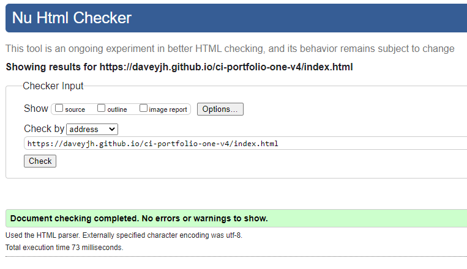
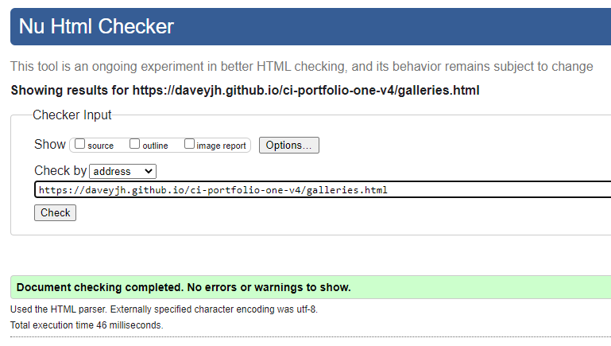
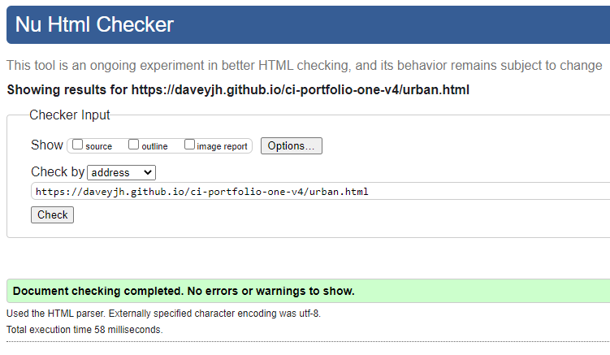
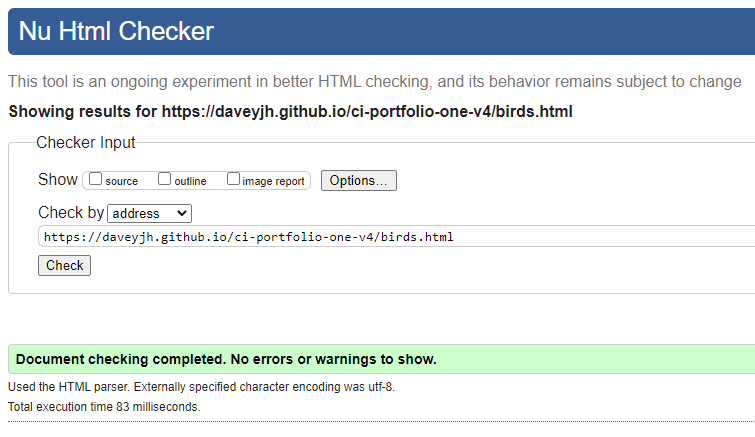
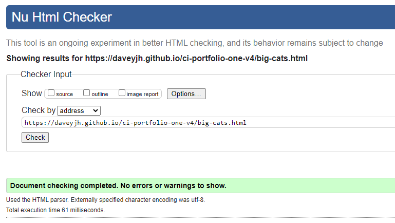
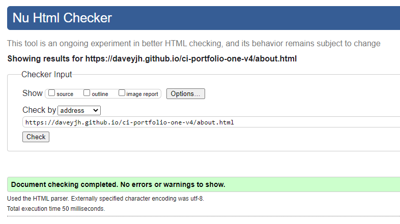
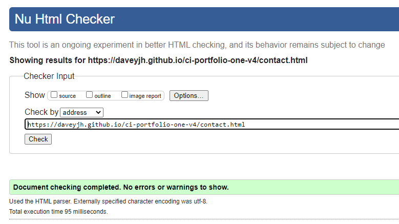
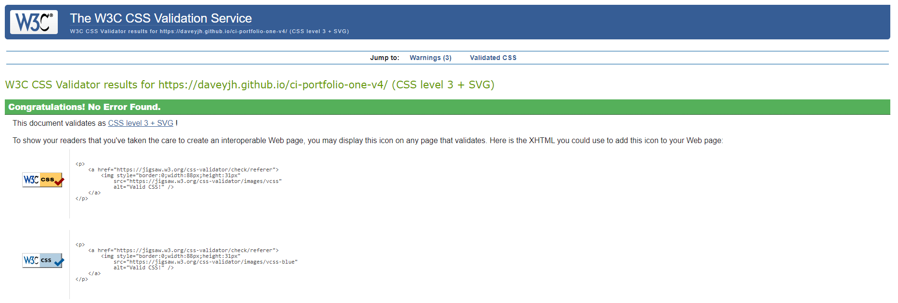
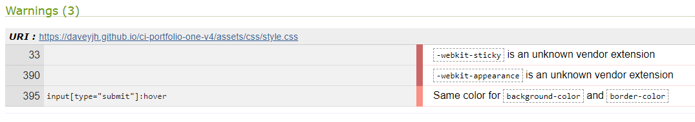

# W3C Markup Validation
[Return to main](../README.md)
- [HTML](#HTML)
    -  [Index](#Index)
    - [Galleries](#Galleries)
        - [Urban](#Urban)
        - [Birds](#Birds)
        - [Big Cats](#Big-Cats)
    - [About](#About)
    - [Contact](#Contact)
- [CSS](#CSS)
    - [Warnings](#Warnings)
## HTML
### Index

### Galleries

#### Urban

#### Birds

#### Big Cats

### About

### Contact

***
## CSS

### Warnings

The first two warnings relate to 'unkown vendor extensions' and are present to ensure the style remains the same on iOS devices
- -webkit-sticky is used maintain the sticky position of the nav section on all pages
- -webkit-appearance is used to allow styling of buttons

The third warning regards the repeated colour value (between background and border) used for the styling of the button when hovered. The colour is intentionally the same and so is not something I am worried about

[Return to main](../README.md)